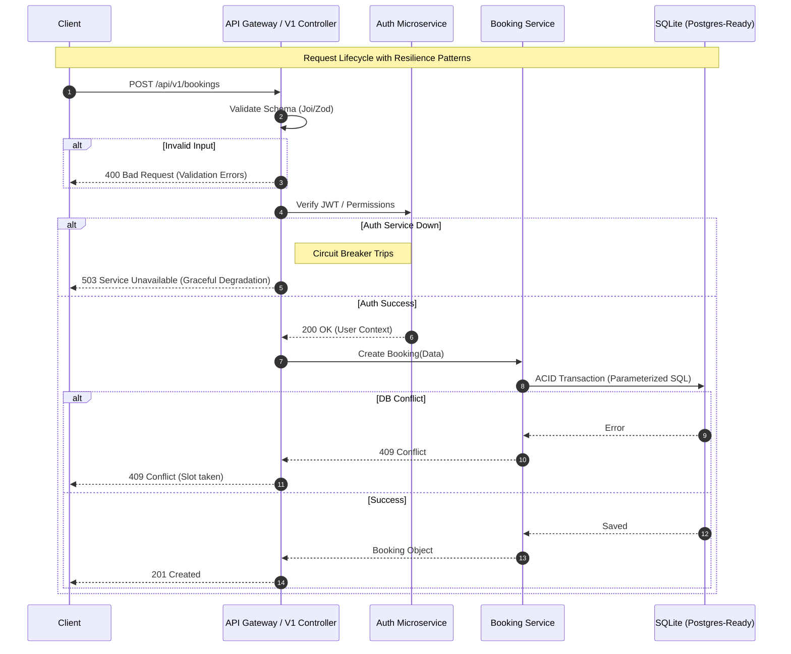

# Architecture Overview

This project follows a layered architecture pattern designed for maintainability, testability, and clear separation of concerns.

## System Architecture

The application is built as a RESTful microservice that manages the core business logic for Paris Classic Car Tours. It interacts with an external Authentication Microservice for identity management.

### Sequence Diagram: Booking Creation Flow

## Internal Layers

### 1. Presentation Layer (Controllers)
Located in `src/Controllers/`. Responsible for:
- Handling HTTP requests and returning JSON responses.
- Basic request parameter extraction.
- Calling appropriate repository methods.
- Mapping domain objects to JSON arrays.

### 2. Domain Layer (Models)
Located in `src/Models/`. Responsible for:
- Defining the business entities (Car, User, Tour, Booking).
- Encapsulating business rules and validation logic.
- Self-validation through `validate()` and constructor checks.

### 3. Data Access Layer (Repositories)
Located in `src/Repositories/`. Responsible for:
- All database interactions (CRUD).
- Abstracting SQL complexity from the rest of the application.
- Enforcing data integrity at the database level.
- Handling complex queries and transactions.

### 4. Middleware Layer
Located in `src/Middlewares/`. Responsible for:
- Cross-cutting concerns like CORS, JSON body parsing, and Authentication validation.

## Data Persistence
- **SQLite:** Used for development and lightweight production.
- **Portability:** The use of PDO and standard SQL patterns makes the application ready for migration to PostgreSQL or MySQL if higher scale is required.

## Testing Strategy
- **Unit Testing:** Focuses on the Domain Layer (Models) to ensure business rules are correctly enforced without database dependencies.
- **Integration Testing:** Focuses on the Data Access Layer (Repositories) using an in-memory SQLite database to verify SQL queries and data persistence.
